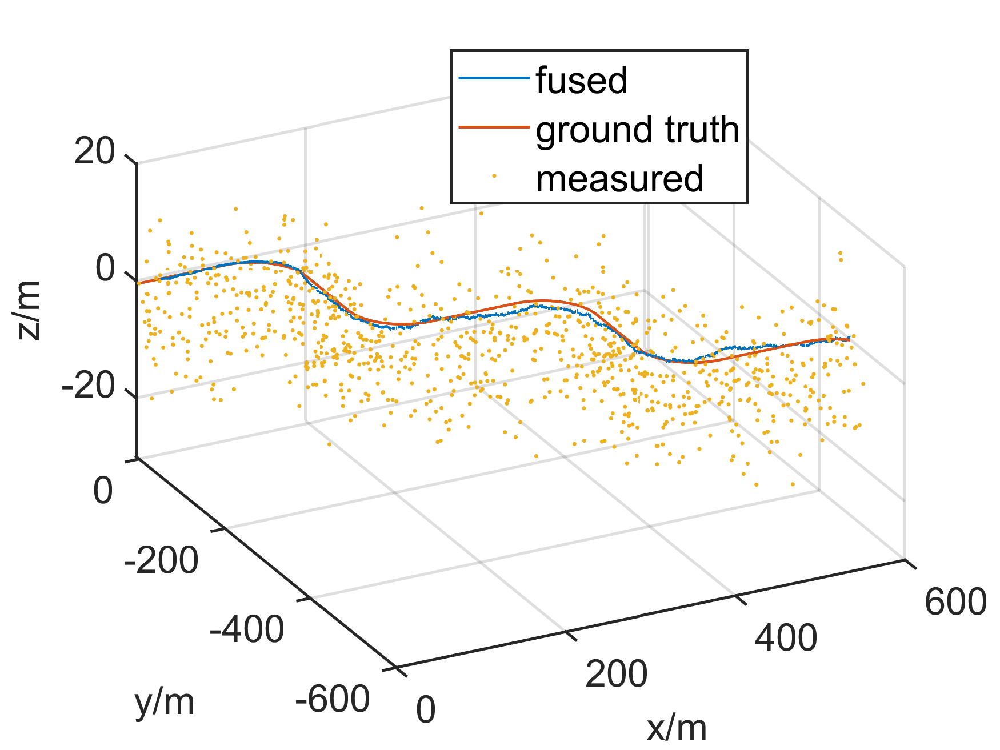

# eskf (error state kalman filter)
- adapted from https://github.com/zm0612/eskf-gps-imu-fusion
- add support for condition where the gps antenna is not at the center of imu.
- reference: https://hal.science/hal-01122406/document

# code structure
- eskf.*: one step eskf implementation
- eskf_flow.*: feed data and process
- *_data.h: gps and imu data sample
- gps_flow.* imu_flow.*: read all data samples from file
# test
